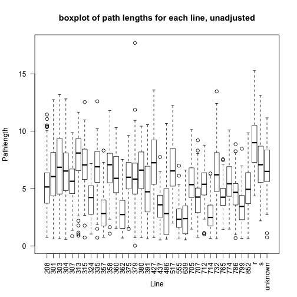
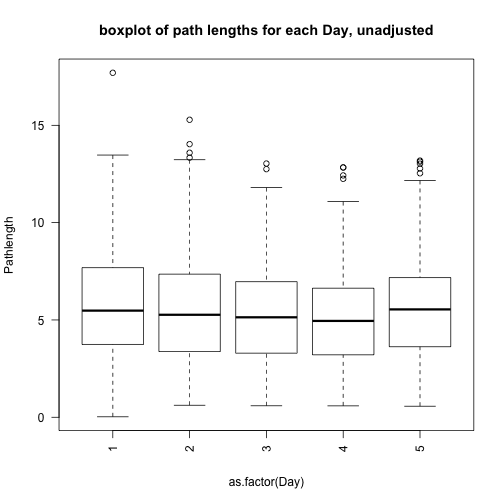
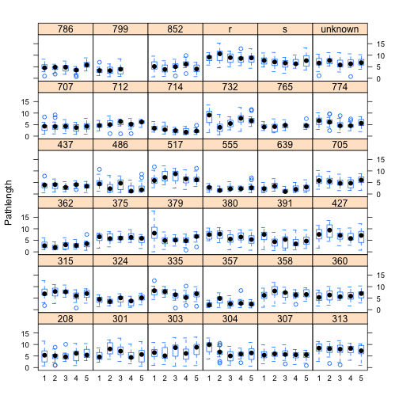
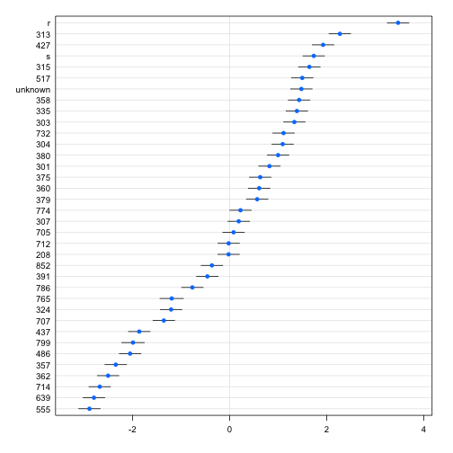

##Analysis and comparison of larval path-lengths for _Drosophila melanogaster_ (DGRP, rovers and sitters) from Turner et al. 2014. and as collected from the Sokolowski lab

Analysis performed by Ian Dworkin
April 29th 2014

###Introduction
The reason for this re-analysis is based upon figure 1 of [Turner et. al. 2014](http://biorxiv.org/content/early/2014/04/20/004325.full-text.pdf+html). It was unclear how the data was modeled, and in particular whether the experimental designed included sufficient blocking to account for the well known effects of environmental (day-to-day) variation on this (and many other) behaviours, as appropriate. Given that the data appears to have been collected using an unbalanced incomplete block design, this can induce some "colinearities" and in particular will confound date and genetic (line) effects, which will then only be partially seperable in any statistical model. In addition the average path lengths for the _Drosophila_ larvae seemed quiet short.

While unpublished the Sokolowski lab has also measured larval foraging pathlengths for most of the same set of [DGRP lines](http://dgrp.gnets.ncsu.edu/). I have analyzed these lines as well in the same manner as the data from Turner et al. This analysis is not at all about the genome wide associations, but simply about assessing sources of variability in measurement for larval path length, and how well correlated measures are across labs.


Call in R Libraries

```r
require(Rcpp)
require(lme4)
require(lattice)
```


I am assuming that this script is starting using the folder I structure I set up (with sub-folders for data and scripts).

I have also generated a `.csv` file from the original excel file for ease of use.

```r
tk_path_lengths <- read.csv("../TurnerKern_data/TurnerKernForaging.csv", h = T)

# Checking data input
summary(tk_path_lengths)
```

```
##        Date          Line         Distance           Temp     
##  12/10/09:322   360    :  81   Min.   : 0.126   Min.   :19.5  
##  1/2/10  :263   s      :  69   1st Qu.: 0.723   1st Qu.:21.2  
##  1/16/10 :197   486    :  61   Median : 1.117   Median :21.7  
##  11/18/09:191   732    :  61   Mean   : 2.069   Mean   :21.7  
##  1/11/10 :186   517    :  60   3rd Qu.: 2.557   3rd Qu.:22.4  
##  1/13/10 :140   774    :  60   Max.   :15.638   Max.   :23.0  
##  (Other) :817   (Other):1724
```

```r
str(tk_path_lengths)
```

```
## 'data.frame':	2116 obs. of  4 variables:
##  $ Date    : Factor w/ 18 levels "1/11/10","1/13/10",..: 16 6 6 1 6 6 6 6 6 1 ...
##  $ Line    : Factor w/ 39 levels "208","301","303",..: 1 1 1 1 1 1 1 1 1 1 ...
##  $ Distance: num  0.259 0.301 0.315 0.317 0.32 0.325 0.358 0.368 0.374 0.398 ...
##  $ Temp    : num  21 21.4 21.4 22.8 21.4 21.5 21.5 21.4 21.5 22.8 ...
```

```r
head(tk_path_lengths)
```

```
##       Date Line Distance Temp
## 1 12/21/09  208    0.259 21.0
## 2   1/2/10  208    0.301 21.4
## 3   1/2/10  208    0.315 21.4
## 4  1/11/10  208    0.317 22.8
## 5   1/2/10  208    0.320 21.4
## 6   1/2/10  208    0.325 21.5
```

```r
tail(tk_path_lengths)
```

```
##          Date Line Distance Temp
## 2111 12/10/09   s2    4.121 21.2
## 2112 12/15/09   s2    4.212 21.2
## 2113 12/10/09   s2    4.295 21.2
## 2114 12/10/09   s2    5.320 21.2
## 2115 12/10/09   s2    5.426 21.2
## 2116 12/10/09   s2    6.459 21.2
```

```r

# Checking to see if there is any missing data
colSums(is.na(tk_path_lengths))
```

```
##     Date     Line Distance     Temp 
##        0        0        0        0
```


Let's Look at the structure of the data with respect to how many samples were phenotyped on a given date.

```r
table(tk_path_lengths$Date)
```

```
## 
##  1/11/10  1/13/10  1/16/10  1/18/10  1/19/10   1/2/10  1/25/10  1/26/10 
##      186      140      197      129      108      263       55       19 
## 11/16/09 11/18/09 11/23/09 11/24/09  11/9/09 12/10/09 12/15/09 12/21/09 
##       37      191       88      117       72      322      140       45 
##  2/23/10   3/2/10 
##        5        2
```

Number of individual larvae sampled varies considerably by date.

How about sample sizes across lines

```r
table(tk_path_lengths$Line)
```

```
## 
## 208 301 303 304 307 313 315 324 335 357 358 360 362 365 375 379 380 391 
##  50  56  56  51  58  58  52  50  52  59  50  81  51  54  51  55  59  54 
## 399 427 486 514 517 555 639 705 707 712 714 730 732 765 774 786 820 852 
##  58  54  61  50  60  57  54  56  28  42  53  43  61  51  60  52  50  50 
##   r   s  s2 
##  59  69  51
```


Finally numbers of individuals measured for each line on a given day.

```r
table(tk_path_lengths[, 1:2])
```

```
##           Line
## Date       208 301 303 304 307 313 315 324 335 357 358 360 362 365 375 379
##   1/11/10   15  14   0   0   0   0  30   0   3  10   0   0   0   1   0  20
##   1/13/10    0   7   0   0   0   0   0   0  20   8   0   0   0   2   0   0
##   1/16/10    0  12   0   0   0   0   0   0  17  36   0   0   0  19   0   0
##   1/18/10    0   0   0   6   0   0   0   0   0   0   0   0   0  20   0   0
##   1/19/10    0   0   0  14   0   0   0   0   0   0   0   0   0   0   0   0
##   1/2/10    32  17   0   0  36   0  22  14   0   5   0   0  48   6   0   3
##   1/25/10    0   0   0  31   0   0   0   0  12   0   0   0   0   0   0   0
##   1/26/10    0   0   0   0   0   0   0   0   0   0   0   0   0   0   0   0
##   11/16/09   0   0   0   0   0   0   0   0   0   0   0  25   0   0   0   0
##   11/18/09   0   0   0   0   2   0   0   0   0   0   0  24   0   0   0   0
##   11/23/09   0   0   5   0   0   0   0   0   0   0   0  21   0   0   0   3
##   11/24/09   0   0   4   0   0   0   0   0   0   0   0  11   0   0   0   0
##   11/9/09    0   0   0   0   0   0   0   0   0   0   0   0   0   0   0   0
##   12/10/09   0   0  17   0  20  58   0  23   0   0  50   0   2   0  51  16
##   12/15/09   1   6  30   0   0   0   0  11   0   0   0   0   1   3   0   0
##   12/21/09   2   0   0   0   0   0   0   2   0   0   0   0   0   3   0  13
##   2/23/10    0   0   0   0   0   0   0   0   0   0   0   0   0   0   0   0
##   3/2/10     0   0   0   0   0   0   0   0   0   0   0   0   0   0   0   0
##           Line
## Date       380 391 399 427 486 514 517 555 639 705 707 712 714 730 732 765
##   1/11/10    0   3   0   0  12  28  18   0   0   2  12   0  14   4   0   0
##   1/13/10    0  35   0   0  21   7   0   0   0   5   6   0  23   6   0   0
##   1/16/10    0   7   0   0  12   0  35   0   0  36   0   0  12  11   0   0
##   1/18/10    0   0   0  54   0   0   0   8   0   0   0  26   0   2   0  11
##   1/19/10    0   0   0   0   0   0   0   0   0   0   1  16   0   0   0  29
##   1/2/10     0   8   0   0   9   7   0   0   0  11   0   0   3   6  36   0
##   1/25/10    0   0   0   0   0   1   0   0   0   0   0   0   0   0   0  11
##   1/26/10    0   0   0   0   0   4   0   0   0   0   8   0   0   7   0   0
##   11/16/09   0   0   0   0   0   0   0   0   0   0   0   0   0   0   0   0
##   11/18/09   0   0  28   0   0   0   0   0   0   0   0   0   0   0   0   0
##   11/23/09  31   0  17   0   0   0   0  11   0   0   0   0   0   0   0   0
##   11/24/09  16   0  13   0   0   0   0  34   0   0   0   0   0   0   0   0
##   11/9/09    0   0   0   0   0   0   0   0   0   0   0   0   0   0   0   0
##   12/10/09  12   0   0   0   0   0   0   1  20   0   0   0   0   0   3   0
##   12/15/09   0   1   0   0   7   1   3   0  34   2   0   0   1   0   9   0
##   12/21/09   0   0   0   0   0   2   4   3   0   0   0   0   0   1  13   0
##   2/23/10    0   0   0   0   0   0   0   0   0   0   0   0   0   5   0   0
##   3/2/10     0   0   0   0   0   0   0   0   0   0   1   0   0   1   0   0
##           Line
## Date       774 786 820 852  r  s s2
##   1/11/10    0   0   0   0  0  0  0
##   1/13/10    0   0   0   0  0  0  0
##   1/16/10    0   0   0   0  0  0  0
##   1/18/10    0   0   2   0  0  0  0
##   1/19/10    0   0  48   0  0  0  0
##   1/2/10     0   0   0   0  0  0  0
##   1/25/10    0   0   0   0  0  0  0
##   1/26/10    0   0   0   0  0  0  0
##   11/16/09   0   0   0  12  0  0  0
##   11/18/09  60   8   0   6  0 59  4
##   11/23/09   0   0   0   0  0  0  0
##   11/24/09   0  19   0  18  0  0  2
##   11/9/09    0   0   0   0 59 10  3
##   12/10/09   0   7   0   9  0  0 33
##   12/15/09   0  16   0   5  0  0  9
##   12/21/09   0   2   0   0  0  0  0
##   2/23/10    0   0   0   0  0  0  0
##   3/2/10     0   0   0   0  0  0  0
```


Note that for a number of lines, they were only measured on a single day only (r, 820, 774, 427, 375,358, 313). Even for other lines often the bulk of measurements are on one day, with only a few on any other day. Given the structure of the blocking, this may lead to confounding of date and line effects. While fitting an appropriate model may help a bit, confounding between these sources of variation will still be present, and may have considerable influence on the estimates. 

### Some simple plots to look at the variation
We can look at variation among lines (not accounting for variation due to date).

```r
plot(Distance ~ Line, data = tk_path_lengths, las = 2)
```

 

We can look at variation in pathlengths across dates as well.

```r
plot(Distance ~ as.factor(Date), data = tk_path_lengths, las = 2)
```

 


Not sure if this is as helpful here, but variation for each line across Dates. The plot is a bit messy.

```r
bwplot(Distance ~ as.factor(Date) | Line, data = tk_path_lengths, las = 2)
```

 


## Mixed models for the DGRP data.
There are two reasonable mixed models to consider fitting:

1. Either as a crossed effect (with both line and date as independent random effects that do not co-vary),
2. Or by nesting (or interaction), which will be far more difficult to estimate with this data. While I do fit it, I am less certain as to the validity of the estimates in this case.

First I am going to center Temp (assay temperature I think) so estimates are not extrapolating too far out. Then fit the linear mixed model.


```r
tk_path_lengths$Temp_c <- scale(tk_path_lengths$Temp, center = TRUE, scale = FALSE)

mod1 <- lmer(Distance ~ Temp_c + (1 | Date) + (1 | Line), data = tk_path_lengths, 
    REML = TRUE)

# Let's take a look at the summary from this model.

summary(mod1)
```

```
## called print.summary.merMod
## Linear mixed model fit by REML ['lmerMod']
## Formula: Distance ~ Temp_c + (1 | Date) + (1 | Line) 
##    Data: tk_path_lengths 
## 
## REML criterion at convergence: 8876 
## 
## Random effects:
##  Groups   Name        Variance Std.Dev.
##  Line     (Intercept) 0.882    0.939   
##  Date     (Intercept) 0.621    0.788   
##  Residual             3.633    1.906   
## Number of obs: 2116, groups: Line, 39; Date, 18
## 
## Fixed effects:
##             Estimate Std. Error t value
## (Intercept)    2.071      0.251    8.24
## Temp_c        -0.162      0.137   -1.18
## 
## Correlation of Fixed Effects:
##        (Intr)
## Temp_c -0.022
```


Note that line and Date variance are both about the same magnitude.

Here are the blups with ~SE for the random effects. you can add 2.0709 to get the 'line means'.


```r
dotplot(ranef(mod1, condVar = TRUE), scales = list(x = list(relation = "free")), 
    strip = FALSE)[["Line"]]
```

 


However, as I noted before there are some very concerning effects due to Date, and the lack of balance. With respect to the overall variance in date:


```r
dotplot(ranef(mod1, condVar = TRUE), scales = list(x = list(relation = "free")), 
    strip = FALSE)[["Date"]]
```

 


Basically there is almost as much variances across dates as across lines. This would not be a substantial issue (and the model could account for this), if the experiment was appropriately blocked across days. Unfortunately, it will be hard to seperate these sources of variation with this data.

### Some checks on the models (confirming the importance of both Date and Line).


```r
mod1_noDate <- lmer(Distance ~ Temp_c + (1 | Line), data = tk_path_lengths, 
    REML = TRUE)
mod1_noLine <- lmer(Distance ~ Temp_c + (1 | Date), data = tk_path_lengths, 
    REML = TRUE)
mod1_noTemp <- lmer(Distance ~ 1 + (1 | Date) + (1 | Line), data = tk_path_lengths, 
    REML = TRUE)
```


Model allowing for date to vary with line (essentially an interaction). This is not perfect model either (mod1 is still the most appropriate). This is mostly a double check (and would not be my choice of model).


```r
mod2 <- lmer(Distance ~ Temp_c + (1 | Line) + (1 | Date) + (1 | Date:Line), 
    data = tk_path_lengths, REML = TRUE)
```


Some plots of these effects. The first examines the `Date:Line` variance.


```r
dotplot(ranef(mod2, condVar = TRUE), scales = list(x = list(relation = "free")), 
    strip = FALSE)[["Date:Line"]]
```

 


We can also examine the `Date` and `Line` variances for these terms.


```r
dotplot(ranef(mod2, condVar = TRUE), scales = list(x = list(relation = "free")), 
    strip = FALSE)[["Date"]]
```

 

```r
dotplot(ranef(mod2, condVar = TRUE), scales = list(x = list(relation = "free")), 
    strip = FALSE)[["Line"]]
```

 


My point for this was not to examine any aspect of model selection, or significance testing, but for those who care... (also I have not included any parametric boostrap to really compare logLik).


```r
AIC(mod1, mod1_noDate, mod1_noLine, mod1_noTemp, mod2)
```

```
##             df  AIC
## mod1         5 8886
## mod1_noDate  4 8951
## mod1_noLine  4 9183
## mod1_noTemp  4 8883
## mod2         6 8857
```

```r
BIC(mod1, mod1_noDate, mod1_noLine, mod1_noTemp, mod2)
```

```
##             df  BIC
## mod1         5 8915
## mod1_noDate  4 8974
## mod1_noLine  4 9206
## mod1_noTemp  4 8906
## mod2         6 8891
```

```r
logLik(mod1)
```

```
## 'log Lik.' -4438 (df=5)
```

```r
logLik(mod1_noDate)
```

```
## 'log Lik.' -4472 (df=4)
```

```r
logLik(mod1_noLine)
```

```
## 'log Lik.' -4588 (df=4)
```


Evidence is consistent with requiring a fit of both line and Date in the model, so we will continue with using `mod1`. Temp seems to contribute little, but also does not influence other estimates by a great degree (examine model summaries as below, not shown here). So I will keep it in. 

#### Confidince intervals from mod1

```r
CI_mod1 <- confint(mod1)
```

```
## Computing profile confidence intervals ...
```

```r
CI_mod1
```

```
##               2.5 % 97.5 %
## .sig01       0.7381 1.2093
## .sig02       0.4617 1.2569
## .sigma       1.8491 1.9659
## (Intercept)  1.5761 2.5793
## Temp_c      -0.4312 0.1089
```

Variances for both Line and Date are of a similar magnitude.

### Some internal comparisons. Pulling out coefficients


```r
coef_mod1 <- coef(mod1)
lines_mod1 <- as.data.frame(coef_mod1$Line[, 1])
rownames(lines_mod1) <- rownames(coef_mod1$Line)

### confirming that the above coefs are the BLUPs + intercept. Confirmed...
ranef_mod1 <- ranef(mod1)
lines_ranef_mod1 <- unlist(ranef_mod1$Line)
cor(lines_mod1, lines_ranef_mod1)
```

```
##                     [,1]
## coef_mod1$Line[, 1]    1
```

```r
plot(lines_mod1[, 1], lines_ranef_mod1, pch = 20)
```

 


Compare correlations between the raw line means (which is what I think were used in Turner et al, and the BLUPs).

Note: I double checked that lines are coming into the vectors the same.

Keep in mind that _a priori_ we expect these estimates to be highly correlated because of the unbalanced, incomplete blocking experimental design employed, which means date and line variance are confounded to an unknown degree.


```r
# This computes raw line means, ignoring sample sizes or dates.
line_means <- tapply(tk_path_lengths$Distance, INDEX = tk_path_lengths$Line, 
    FUN = mean)

cor(line_means, lines_mod1)
```

```
##      coef_mod1$Line[, 1]
## [1,]              0.8987
```

```r
plot(line_means, lines_mod1[, ], pch = 20)
```

 


### rough estimates of co-linearity induced by the lack of balance.
 
While this will only give me a rough idea of how much colinearity there is between date and Line, it may be useful.


```r
# estimate in lm
mod3_lm <- lm(Distance ~ 1 + Temp_c + Line + Date, data = tk_path_lengths)
mod3_lm_noDate <- lm(Distance ~ 1 + Temp_c + Line, data = tk_path_lengths)
mod3_lm_noLine <- lm(Distance ~ 1 + Temp_c + Date, data = tk_path_lengths)
```


First we will examine eigenvalues for X(T)X to get the condition number.


```r
ConditionNumber <- function(model.x = model.object) {
    x <- model.matrix(model.x)
    eigen.x <- eigen(t(x) %*% x)
    sqrt(max(eigen.x$values)/min(eigen.x$values))
}
```


Estimate the condition number for the models.

```r
ConditionNumber(mod3_lm)
```

```
## [1] 51.1
```

```r
ConditionNumber(mod3_lm_noDate)
```

```
## [1] 41.63
```

```r
ConditionNumber(mod3_lm_noLine)
```

```
## [1] 34.05
```


These condition numbers are somewhat high likely due to the lack of balance in samples in terms of both date and line (and the combination).

We can also investgiate using the variance inflation factor. A considerable inflation factor due to line and date together..


```r
car::vif(mod3_lm)
```

```
##            GVIF Df GVIF^(1/(2*Df))
## Temp_c      9.2  1           3.033
## Line   137279.3 38           1.168
## Date   280273.4 17           1.446
```

```r
car::vif(mod3_lm_noDate)
```

```
##         GVIF Df GVIF^(1/(2*Df))
## Temp_c 2.989  1           1.729
## Line   2.989 38           1.015
```

```r
car::vif(mod3_lm_noLine)
```

```
##         GVIF Df GVIF^(1/(2*Df))
## Temp_c 6.103  1           2.470
## Date   6.103 17           1.055
```


Very high for mod3_lm (which is the same overall structure as the primary model to assess line and Date variance).

While there is no doubt there is quantitative variation due to line, the estimates here are confounded with Date of collection, and this can not be seperated out perfectly to assess how much is due to each effect. 


# Analysis of data collected from the first 40 DGRP lines as phenotyped in the lab of Marla Sokolowski.


Note this data used the internal Sokolowski lab nomenclature (`BB` and `ee`) for rover and sitter respectively. I changed these below.

Read in and check data

```r
ms_path_lengths <- read.csv("../TurnerKern_data/MS_DGRP_foraging.csv", h = T)

# Checking data input
summary(ms_path_lengths)
```

```
##       Day           Strain       Pathlength          Line     
##  Min.   :1.00   25176  : 100   Min.   : 0.024   303    : 100  
##  1st Qu.:2.00   25177  : 100   1st Qu.: 3.438   304    : 100  
##  Median :3.00   25179  : 100   Median : 5.263   307    : 100  
##  Mean   :2.97   25182  : 100   Mean   : 5.401   324    : 100  
##  3rd Qu.:4.00   25183  : 100   3rd Qu.: 7.172   335    : 100  
##  Max.   :5.00   25184  : 100   Max.   :17.698   357    : 100  
##                 (Other):2850                    (Other):2850
```

```r
str(ms_path_lengths)
```

```
## 'data.frame':	3450 obs. of  4 variables:
##  $ Day       : int  1 1 1 1 1 1 1 1 1 1 ...
##  $ Strain    : Factor w/ 36 levels "25174","25175",..: 1 1 1 1 1 1 1 1 1 1 ...
##  $ Pathlength: num  11.45 11.06 5.54 6.85 6.22 ...
##  $ Line      : Factor w/ 36 levels "208","301","303",..: 1 1 1 1 1 1 1 1 1 1 ...
```

```r
head(ms_path_lengths)
```

```
##   Day Strain Pathlength Line
## 1   1  25174     11.452  208
## 2   1  25174     11.064  208
## 3   1  25174      5.544  208
## 4   1  25174      6.852  208
## 5   1  25174      6.218  208
## 6   1  25174      5.106  208
```

```r
tail(ms_path_lengths)
```

```
##      Day Strain Pathlength Line
## 3445   5     ee      6.842   ee
## 3446   5     ee     13.132   ee
## 3447   5     ee      8.202   ee
## 3448   5     ee      5.156   ee
## 3449   5     ee     10.098   ee
## 3450   5     ee      9.268   ee
```

```r

# Change BB to 'r' for rover
levels(ms_path_lengths$Line)[34] <- "r"

# Change ee to 's' for sitter
levels(ms_path_lengths$Line)[35] <- "s"

# Checking to see if there is any missing data
colSums(is.na(ms_path_lengths))
```

```
##        Day     Strain Pathlength       Line 
##          0          0          0          0
```


Looking at the structure of the data with respect to how many samples were phenotyped on a given day of phenotyping (days 1-5).


```r
table(ms_path_lengths$Day)
```

```
## 
##   1   2   3   4   5 
## 708 702 701 658 681
```

This shows pretty similar sample sizes across each day of measurement.

How about sample sizes across lines?


```r
table(ms_path_lengths$Line)
```

```
## 
##     208     301     303     304     307     313     315     324     335 
##      97      99     100     100     100      97      98     100     100 
##     357     358     360     362     375     379     380     391     427 
##     100      99      98     100      99     100      96     100      98 
##     437     486     517     555     639     705     707     712     714 
##     100      96     100      95      97      99      99      97      98 
##     732     765     774     786     799     852       r       s unknown 
##      99      47      98     100      59      99      96      94      96
```

With the exception of lines 765 and 799 sample sizes are similar.

How about numbers of individuals measured for each line on a given day?


```r
table(ms_path_lengths[, c(1, 4)])
```

```
##    Line
## Day 208 301 303 304 307 313 315 324 335 357 358 360 362 375 379 380 391
##   1  20  19  20  20  20  20  20  20  20  20  20  20  20  20  20  20  20
##   2  20  20  20  20  20  20  20  20  20  20  20  20  20  20  20  19  20
##   3  20  20  20  20  20  18  18  20  20  20  20  20  20  19  20  20  20
##   4  18  20  20  20  20  19  20  20  20  20  19  18  20  20  20  18  20
##   5  19  20  20  20  20  20  20  20  20  20  20  20  20  20  20  19  20
##    Line
## Day 427 437 486 517 555 639 705 707 712 714 732 765 774 786 799 852  r  s
##   1  20  20  17  20  20  17  19  20  19  19  20  20  20  20  20  20 20 20
##   2  20  20  20  20  20  20  20  19  19  20  20  10  19  20  20  19 19 19
##   3  20  20  20  20  20  20  20  20  20  20  20   9  20  20  19  20 20 19
##   4  18  20  20  20  16  20  20  20  20  19  20   0  20  20   0  20 17 16
##   5  20  20  19  20  19  20  20  20  19  20  19   8  19  20   0  20 20 20
##    Line
## Day unknown
##   1      18
##   2      19
##   3      19
##   4      20
##   5      20
```

A few empty cells, but besides those it is pretty good.

### Some simple plots


```r
plot(Pathlength ~ Line, data = ms_path_lengths, las = 2, main = "boxplot of path lengths for each line, unadjusted")
```

 


```r
plot(Pathlength ~ as.factor(Day), data = ms_path_lengths, las = 2, main = "boxplot of path lengths for each Day, unadjusted")
```

 

Fairly stable effects from day-to-day.


###How much variation is there for each line, across days?

```r
bwplot(Pathlength ~ as.factor(Day) | Line, data = ms_path_lengths, las = 2)
```

 


### Mixed model analysis of pathlengths measured (DGRP lines) in the Sokolowski lab.
Fitting the same model as described above for Turner et. al. (without temperature as that was not measured).


```r
ms_mod1 <- lmer(Pathlength ~ 1 + (1 | Day) + (1 | Line), data = ms_path_lengths, 
    REML = TRUE)

# Let's look at some summaries.
summary(ms_mod1)
```

```
## called print.summary.merMod
## Linear mixed model fit by REML ['lmerMod']
## Formula: Pathlength ~ 1 + (1 | Day) + (1 | Line) 
##    Data: ms_path_lengths 
## 
## REML criterion at convergence: 15028 
## 
## Random effects:
##  Groups   Name        Variance Std.Dev.
##  Line     (Intercept) 2.7446   1.657   
##  Day      (Intercept) 0.0723   0.269   
##  Residual             4.3592   2.088   
## Number of obs: 3450, groups: Line, 36; Day, 5
## 
## Fixed effects:
##             Estimate Std. Error t value
## (Intercept)    5.359      0.303    17.7
```


Some notable differences, in both Line and day-to-day variance as compared to the data discussed above measured in Turner et. al. As the data measured in the Sokolowski lab were measured on 5 consecutive days this seems reasonable. Also, the Sokolowski lab has a very standardized procedure for measuring larval path lengths, which may contribute to this. I am unaware of the technical details in measuring these particular data, as I did not participate.

The other point to make note of is that the overall average path lengths is about twice as long in the Sokolowski lab. compare 5.3589 from the data collected in the Sokolowski lab  to 2.0709 as collected by [Turner et al.](http://biorxiv.org/content/early/2014/04/20/004325.full-text.pdf+html). It is worth noting that previously published path lengths tend to be on the longer side. For example see [Reed et. al. 2010 figure 1F](http://www.genetics.org/content/185/3/1009) for a set of inbred lines also collected in North Carolina.

The BLUPs for the DGRP lines as measured in the Sokolowski lab. 
Note: rover=r and sitter=s.

Here is the variation across lines.

```r
dotplot(ranef(ms_mod1, condVar = TRUE), strip = FALSE, scales = list(x = list(relation = "free")))[["Line"]]
```

 

Showing considerable line to line variation, but all of it less that _rovers_, and mostly less than _sitters_ as well.

Here is the variation across days.

```r
dotplot(ranef(ms_mod1, condVar = TRUE), strip = FALSE, scales = list(x = list(relation = "free")))[["Day"]]
```

 

              
This shows similar patterns of quantitative variation for path lengths to previously published sets of lines, like [Reed et. al. 2010 figure 1F](http://www.genetics.org/content/185/3/1009), but somewhat inconsistent with the measures from the same DGRP lines measured by Turner as discussed above. There are a few lines not shared between each set. 


### Examine the degree of induced colinearity caused by any imbalance. 
Same issues with measuring the potential for confounding effects due to inbalance. If someone knows some better approaches for examining the effects of imbalance in randome effect models (in terms of colinearity), please let me know.


```r
ms_mod1_lm <- lm(Pathlength ~ 1 + as.factor(Day) + Line, data = ms_path_lengths)

ConditionNumber(ms_mod1_lm)
```

```
## [1] 39.6
```

```r
car::vif(ms_mod1_lm)
```

```
##                 GVIF Df GVIF^(1/(2*Df))
## as.factor(Day) 1.019  4           1.002
## Line           1.019 35           1.000
```


Variance inflation factor across comparable models is much smaller for this set of measures as compared to the estimates I generated based on the data in Turner et al.

## Comparing blups and raw line means between the data collected in the Turner/Kern labs and the Sokolowski lab


```r
# Some set up (not really necessary)
ms_mod1_coef <- coef(ms_mod1)
ms_line <- as.data.frame(ms_mod1_coef$Line)
colnames(ms_line) <- "blup"

line_names <- as.character(rownames(ms_line))

ms_line <- as.data.frame(cbind(ms_line, line_names))
tt_line <- as.data.frame(cbind(lines_mod1, names = rownames(lines_mod1)))

merged_data <- merge(ms_line, lines_mod1, by = "row.names")
```


### Comparing the adjusted estimates from both sets of measures.


```r
plot(merged_data[, c(2, 4)], xlab = "Sokolowski", ylab = "Turner_Kern", pch = 20, 
    main = "Correlation of BLUPs for DGRP lines as measured across two labs")
```

 

```r

# Consistent with plot the data is only moderately correlated.
cor.test(x = merged_data[, 2], y = merged_data[, 4])
```

```
## 
## 	Pearson's product-moment correlation
## 
## data:  merged_data[, 2] and merged_data[, 4]
## t = 2.966, df = 31, p-value = 0.005757
## alternative hypothesis: true correlation is not equal to 0
## 95 percent confidence interval:
##  0.1513 0.7004
## sample estimates:
##    cor 
## 0.4702
```


#### I double checked these results using the straight up line means as measured in both labs.


```r
tt_line_means <- tapply(tk_path_lengths$Distance, INDEX = tk_path_lengths$Line, 
    FUN = mean)
ms_line_means <- tapply(ms_path_lengths$Pathlength, INDEX = ms_path_lengths$Line, 
    FUN = mean)

merged_line_means <- merge(tt_line_means, ms_line_means, by = "row.names")
cor.test(merged_line_means[, 2], merged_line_means[, 3])
```

```
## 
## 	Pearson's product-moment correlation
## 
## data:  merged_line_means[, 2] and merged_line_means[, 3]
## t = 2.979, df = 31, p-value = 0.005576
## alternative hypothesis: true correlation is not equal to 0
## 95 percent confidence interval:
##  0.1533 0.7015
## sample estimates:
##    cor 
## 0.4718
```

```r

plot(merged_line_means[, c(3, 2)], pch = 20, main = "Correlation of line means (unadjusted) for DGRP lines as measured across two labs", 
    xlab = "Sokolowski", ylab = "Turner_Kern")
```

 

Based on my analyses of these data, I do not think it is likely that the pathlengths measured by Turner et al. are really measuring the same phenotype as reported in the literature. This is based largely on two findings. First that the pathlengths reported in Turner et al. are approximately half the length as found for the same set of lines as measured in the Sokolowski lab, and also widely reported in the literature. Second the estimates from the Turner et al. data are at best only moderatedly correlated (~0.47), for the same set of lines as also measured in the Sokolowski lab. While the argument could be viewed as circular, it is clear that the Sokolowski lab has a great deal of expertise in phenotyping larval pathlengths.

The finding that in the Turner et al. data that the _rover_ lines do not have a particularly extreme phenotype relative to the DGRP lines is troubling in the context of it showing a very different pattern as compared to the Sokolowski measures (for _rover_ and the DGRP) where _rover_ is quite extreme. The results from my analysis of the Sokolowski data of the DGRP and _rover_ and _sitter_ and consistent with previous comparisons with other inbred lines derived from natural populations in North Carolina (Reed et al. 2010.)

Finally, the lack of balance in the experimental design of Turner et. al. does mean that the blocking (Date) and genetic (line) variances are confounded, and can not be partitioned appropriately. Thus any estimates based on these data need to viewed with caution, in terms of estimates, heritability and downstream use such as the genome wide associations.  
